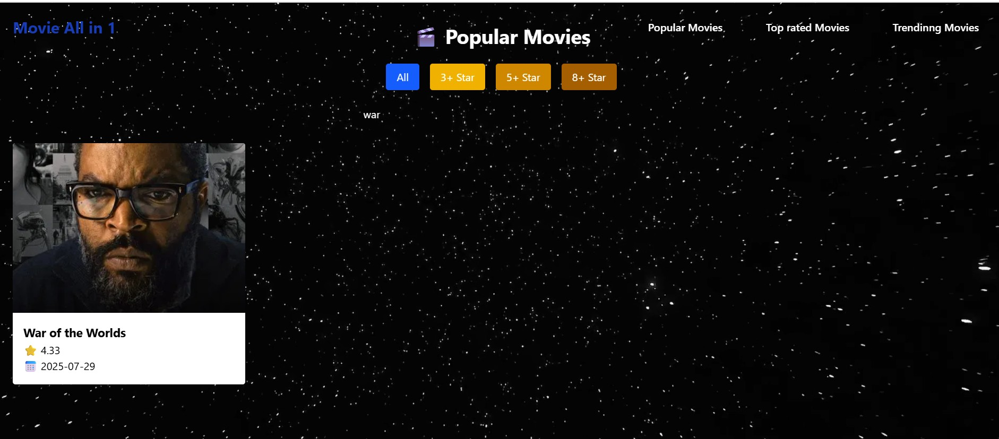
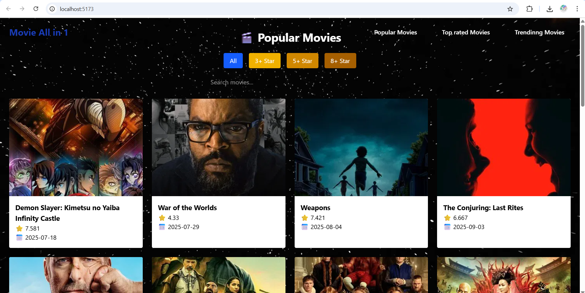

# React Movie App

A movie browsing app built using React and Vite, powered by the TMDB API.  
The app lets users explore popular movies, filter them by rating, and sort them by release date or average rating.  
A proxy server is included to bypass TMDB API restrictions in certain regions like India.

## Features

- Browse popular movies using TMDB API
- Filter movies by rating (8+, 5+, 3+)
- Sort movies by release date or rating
- Responsive movie cards with poster, title, rating, and release date
- Built with React and Vite for fast development
- Optional proxy server support for accessing TMDB in restricted regions

## Tech Stack

- React
- Vite
- Tailwind CSS
- TMDB API
- Node.js and Express (for proxy server)

## Live Demo

View the app at:  
'react-moveiapi-project-p3l61o9x6-heam-vandras-projects.vercel.app'

## Screenshots

| Home Page | Movie Cards |
|-----------|-------------|
|  |  |

Make sure you add actual screenshots to a `screenshots/` folder in your repository.

## Frontend Installation

1. Clone the repository:
   ```bash
   git clone https://github.com/heam-vandra/react-moveiapi-project.git
   cd react-moveiapi-project
